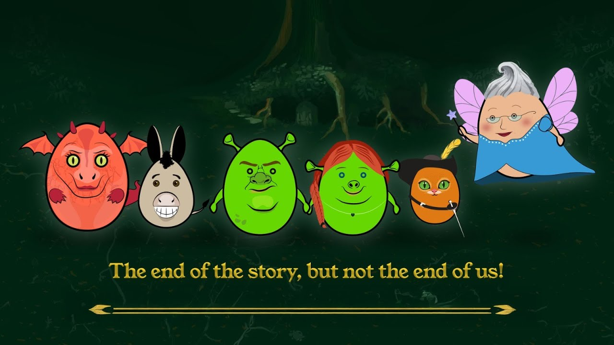

# SHREGG

## Overview

**CLICK THE IMAGE FOR GAMEPLAY VIDEO**

**SHREGG** is an action-packed top-down game inspired by the *Shrek* fairytale. Players will embark on an epic journey with Shrek, defending his home from waves of enemies and ultimately fighting to rescue Princess Fiona at the request of the Dwarf Lord. The game features completely original artwork, animations, and music, created by our team for the Game Jam event.

## Game Features

* **Top-Down View:** Players control Shrek as he battles waves of enemies to protect his home and complete his quest.
* **Weapons:** Start with a basic  *axe* , fighting off enemies in waves as you progress.
* **Health System:** Collect *glowing eyes* to restore 25 health points and continue the fight.
* **Upgrades:** Earn *money* to unlock new abilities and enhancements to make Shrek stronger.
* **Original Music:** Each boss fight is accompanied by unique music, totaling four distinct tracks.
* **Handcrafted Assets:** All in-game artwork, animations, and music are entirely custom-made by our team.

## Story

Shrek, hated by the townspeople, must defend his home from constant attacks. He is tasked by the Dwarf Lord to rescue Princess Fiona from a tower guarded by a fearsome dragon. Along his journey, Shrek battles waves of enemies and collects powerful upgrades to help him on his quest. Upon reaching the tower, Shrek faces the dragon, realizing he can't defeat it through combat alone. Instead, he finds another way to save Fiona and escape with his friends.

## Controls

* **W, A, S, D** : Movement
* **Mouse** : Aim and attack
* **Space** : Use special abilities

## Technologies Used

* **Unity** : Game engine
* **C#** : Programming language
* **Ilustrator** : 3D models and animations
* **FL Studio** : Music and sound effects

## Installation

1. Download the game ZIP file from the GitHub repository or the provided link.
2. Extract the ZIP file and navigate to the game folder.
3. Run the game executable to start playing.

## Contributors

* **Art & Design:** Çağlanur Bilmez
* **Programming:** Samet Emin Özen, Ender Orman, Deniz Kutay Açıcı
* **Music & Sound:** Adam Sattout

## License

This game was developed as part of a *Game Jam* event and all in-game content (art, music, animations) was created entirely by our team. The game and its assets may only be used for personal or educational purposes.
